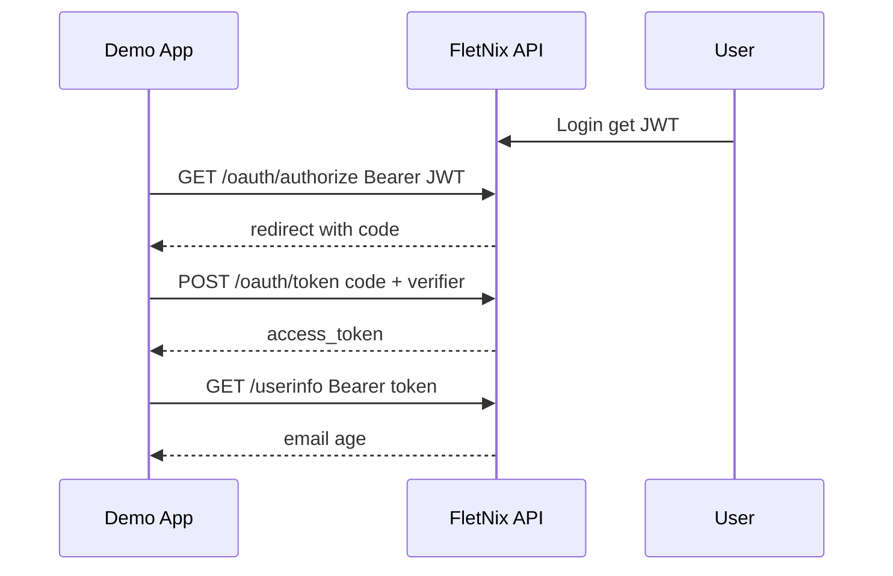

# FletNix OAuth2 SSO (Identity Provider)

FletNix implements **Authorization Code + PKCE** so third-party apps can authenticate users without storing passwords.

## Endpoints

| Method | Path | Description |
|--------|------|-------------|
| GET | `/api/v1/oauth/authorize` | Requires `Authorization: Bearer <fletnix_jwt>`. Returns redirect with `code`. |
| POST | `/api/v1/oauth/token` | Exchange `code` + `code_verifier` for `access_token`. |
| GET | `/api/v1/oauth/userinfo` | Bearer token → `{ sub, email, age, name }`. |

## Demo client

- **client_id:** `fletnix-demo`
- **client_secret:** `demo-secret-change-me` (override via `OAUTH_DEMO_CLIENT_SECRET`)
- **redirect_uri:** `http://localhost:5500/oauth/callback.html`

Open `oauth-demo/index.html` with Live Server (port 5500), login to FletNix, paste your access token, and authorize.

## PKCE flow

## Interview talking points

- Single user store; apps use OAuth instead of duplicate auth.
- PKCE protects public clients that cannot hide a secret.
- Short-lived authorization codes (10 min) with one-time use.
